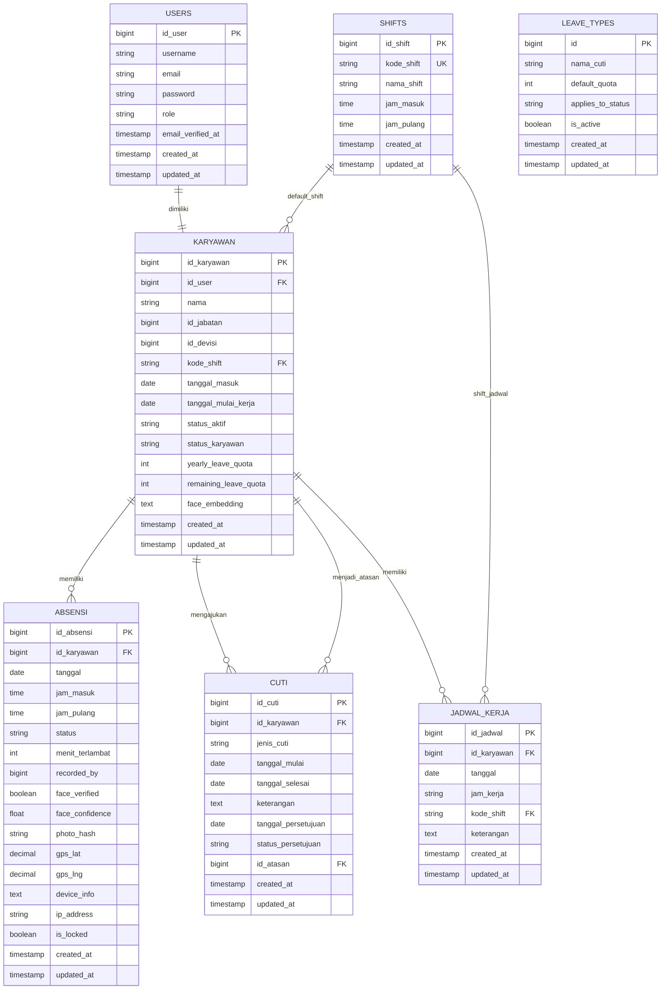

# ERD HRIS Saat Ini

ERD ini mengikuti implementasi operasional aplikasi setelah update import wajah, import karyawan, bulk jadwal, dashboard rekap, dan approval atasan divisi.

Sesuai request, menu/modul yang disembunyikan lewat flagging tidak ditampilkan sebagai entitas ERD: Role Management, Hak Akses, Divisi, dan Jabatan. Field `id_devisi` dan `id_jabatan` tetap ada di `karyawan` karena masih dipakai data karyawan dan approval divisi.

